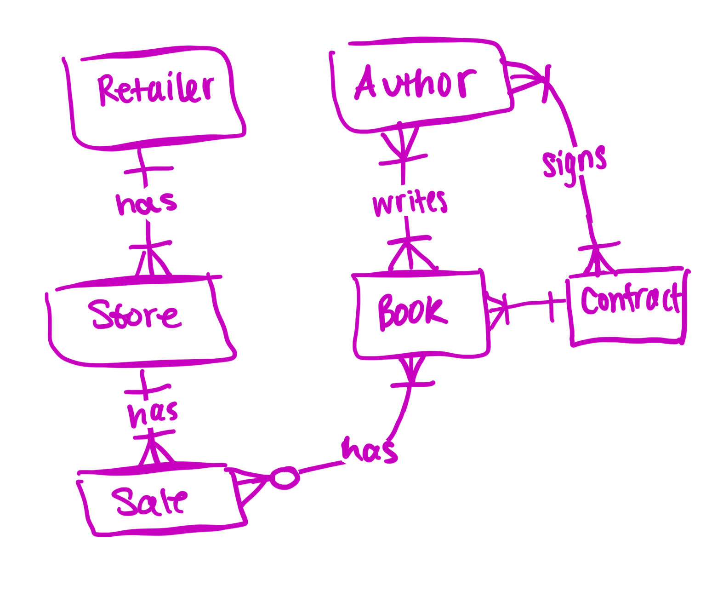

# Harper-Collins-Sales

By Sarah Sattanno

Video overview: <URL HERE>

## Scope

The purpose of the database is to be able to track the lifecycle of books from aquisition to sales for a Book Publishing Company, Harper Collins, and make business decisions based on sales data. Included in the database's scope is:

* Books, including ISBN, title, genre, language, name of publisher or imprint, and release date.
    An imprint is a name or brand under which a publishing company releases books. Major publishers use multiple imprints for market segmentation.
* Authors, including basic identifying information.
* Retailers, including basic identifying information.
* Stores, including bookstore location information.
* Sales, which records individual sales transactions, including the book, format of the book, retailer, store, date of the sale, price, quantity sold and revenue (after any dsicounts).
* Production, including inventory information and unit production cost.
* Contracts, including information on the negotiated terms and the advance paid out to the author.

Out of scope elements include sales outside the U.S. and royalty calculation.

## Functional Requirements

This database will support sales and revenue analysis including:

* Querying total books sold and revenue by genre, format, author, or imprint
* Tracking sales trends over time (monthly, quarterly, annually)
* Identifying top-selling books, authors, and cities
* Comparing sales performance across retailers and store locations
* Filtering sales by date ranges, regions, or formats

This database will also support tracking book, author, contract and production information.

Note that in this iteration, the system will not support:
* Marketing data, such as ad spending or BookTok/social media metrics
* Competitor data
* Detailed royalty accounting

## Representation

Entities are captured in SQLite tables with the following schema.

### Entities

#### Books

The `books` table includes:

* `id`, which specifies the unique ID for the book as an `INTEGER`. This column thus has the `PRIMARY KEY` constraint applied.
* `ISBN`, which specifies the book's ISBN as `TEXT`. A `UNIQUE` constraint ensures no two books share the same ISBN. This column also has the `NOT NULL` constraint applied.
* `title`, which specifies the title of the book as `TEXT`. This column has the `NOT NULL` constraint applied.
* `genre`, which specifies the genre of the book as `TEXT`.
* `language`, which specifies the language the book is written in as `TEXT`.
* `imprint`, which specifies the HarperCollins imprint that published the book as `TEXT`.
* `release_date`, which specifies the book's publication date. Dates in SQLite can be conveniently stored as `NUMERIC`, per SQLite documentation. This column has the `NOT NULL` constraint applied.

#### Authors

The `authors` table includes:

* `id`, which specifies the unique ID for the author as an `INTEGER`. This column thus has the `PRIMARY KEY` constraint applied.
* `first_name`, which specifies the author's first name as `TEXT`. This column has the `NOT NULL` constraint applied.
* `last_name`, which specifies the author's last name as `TEXT`. This column has the `NOT NULL` constraint applied.

#### Authored

The `authored` table includes:

* `book_id`, which is the ID of the book as an `INTEGER`. This column thus has the `FOREIGN KEY` constraint applied, referencing the id column in the books table to ensure data integrity.
* `author_id`, which is the ID of the author as an `INTEGER`. This column thus has the `FOREIGN KEY` constraint applied, referencing the id column in the authors table to ensure data integrity.

This table serves as a junction table, allowing a book to have multiple authors and an author to have multiple books.

#### Retailers

The `retailers` table includes:

* `id`, which specifies the unique ID for the retailer as an `INTEGER`. This column thus has the `PRIMARY KEY` constraint applied.
* `name`, which specifies the retailer's name as `TEXT`. This column has the `NOT NULL` constraint applied.

#### Stores

The `stores` table includes:

* `id`, which specifies the unique ID for the store as an `INTEGER`. This column thus has the `PRIMARY KEY` constraint applied.
* `retailer_id`, which is the ID of the retailer that operates the store as an `INTEGER`. This column thus has the `FOREIGN KEY` constraint applied, referencing the id column in the retailers table to ensure data integrity.
* `city`, which specifies the city in which the store is located as `TEXT`.
* `state`, which specifies the state in which the store is located as `TEXT`.
region, which specifies the broader US region in which the store is located as `TEXT`.
* `zip`, which specifies the store's zip code as `TEXT`, given that zip codes may have leading zeros and are not used in arithmetic.
* `country`, which specifies the country in which the store is located as `TEXT`.

#### Sales

The `sales` table includes:

* `id`, which specifies the unique ID for the sale as an `INTEGER`. This column thus has the `PRIMARY KEY` constraint applied.
* `book_id`, which is the ID of the book sold as an `INTEGER`. This column thus has the `FOREIGN KEY` constraint applied, referencing the id column in the books table to ensure data integrity.
* `format`, which specifies the format in which the book was sold (e.g. Hardcover, eBook, Audiobook) as `TEXT`.
* `retailer_id`, which is the ID of the retailer that made the sale as an `INTEGER`. This column thus has the `FOREIGN KEY` constraint applied, referencing the id column in the retailers table to ensure data integrity.
* `store_id`, which is the ID of the store location where the sale occurred as an `INTEGER`. This column thus has the `FOREIGN KEY` constraint applied, referencing the id column in the stores table to ensure data integrity.
* `date`, which specifies the date on which the sale occurred. Dates in SQLite can be conveniently stored as `NUMERIC`, per SQLite documentation. This column has the `NOT NULL` constraint applied, with a default value of the current timestamp as denoted by `DEFAULT CURRENT_TIMESTAMP`.
* `price`, which specifies the sale price of the book as a `REAL`. This column has the `NOT NULL` constraint applied.
* `quantity_sold`, which specifies the number of copies sold in the transaction as an `INTEGER`. This column has the `NOT NULL` constraint applied.
* `revenue`, which specifies the total revenue generated by the transaction as a `REAL`, calculated as price multiplied by quantity sold.

#### Production

The `production` table includes:

* `id`, which specifies the unique ID for the production record as an `INTEGER`. This column thus has the `PRIMARY KEY` constraint applied.
* `book_id`, which is the ID of the book as an `INTEGER`. This column thus has the `FOREIGN KEY` constraint applied, referencing the id column in the books table to ensure data integrity.
* `print_run`, which specifies the print run edition of the book as `TEXT`.
quantity_in_stock, which specifies the number of copies currently in stock as an `INTEGER`.
* `warehouse_location`, which specifies the warehouse where the inventory is stored as `TEXT`.
* `unit_production_cost`, which specifies the cost to produce a single copy of the book as a `REAL`. This column has the `NOT NULL` constraint applied.
* `reorder_point`, which specifies the stock level at which a reorder should be triggered as an `INTEGER`.

#### Contracts

The `contracts` table includes:

* `id`, which specifies the unique ID for the contract as an `INTEGER`. This column thus has the `PRIMARY KEY` constraint applied.
* `book_id`, which is the ID of the book the contract pertains to as an INTEGER. This column thus has the `FOREIGN KEY` constraint applied, referencing the id column in the books table to ensure data integrity.
* `author_id`, which is the ID of the author the contract belongs to as an `INTEGER`. This column thus has the `FOREIGN KEY` constraint applied, referencing the id column in the authors table to ensure data integrity.
* `advance_paid`, which specifies the advance payment made to the author as a `REAL`. This column has the `NOT NULL` constraint applied.
* `base_royalty_rate`, which specifies the author's base royalty rate as a `REAL`. This column has the `NOT NULL` constraint applied.
* `royalty_split`, which specifies how royalties are divided among co-authors as `TEXT`.
* `royalty_details`, which specifies additional details or terms regarding the royalty agreement as `TEXT`.

### Relationships

The below entity relationship diagram describes the relationships among the entities in the database.

As detailed by the diagram:

* An author is capable of writing one to many books. An author signs one to many contracts.
* A book is written by one to many authors. A book is associated with one and only one contract. A book has zero to many sales.
* A contract can be signed by one to many authors. A contract can be associated with one to many books.
* A retailer has one to many stores.
* A store is associated with one retailer. A store has one to many sales.
* A sale can include one to many books within a sale.

## Optimizations

Per the typical queries in `queries.sql`, it is common for users of the database to access all books, sales, or contract data by any particluar author. For that reason, indexes are created on the `first_name` and `last_name` columns to speed the identification of authors by those columns.

Similarly, users will want to acces data filtering by book titles. An index is created on the `title` column to speed the identification of books by title.

Users will want to access data on books that are set to come out this year. The `2026` view was created to perform queries only on books that are new releases.

## Limitations

Note that this is currently a static dataset and won't reflect live sales or inventory changes.
